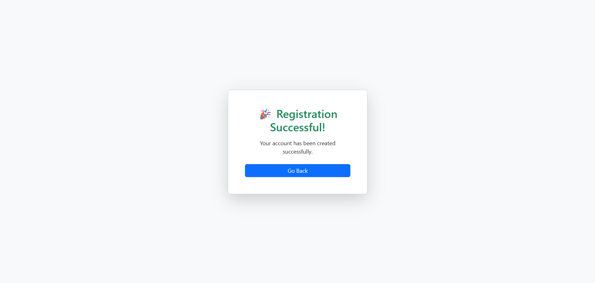

# Django User Registration 

A **modern user registration system** built with **Django** and **Bootstrap 5**, featuring a **frosted-glass registration form**, fullscreen **background image**, and responsive design for all devices.
---

### Folder Structure 🗂️

project_root/

├─ app/ # Django app

│ ├─ migrations/ # Database migrations

│ ├─ init.py

│ ├─ admin.py # Admin panel configuration

│ ├─ apps.py

│ ├─ models.py # Database models

│ ├─ views.py # Views / controllers

│ ├─ urls.py # App-specific URLs

├─ templates/app/ # HTML templates

│ ├─ register.html

│ └─ success.html

├─ static/ # Static files

│ ├─ css/

│ │ └─ style.css # Custom styles including glass effect

│ └─ image/

│ └─ img.webp # Background image

├─ manage.py # Django management script

├─ requirements.txt # Python dependencies

├─ db.sqlite3 # SQLite database (if using SQLite)

├─ ultimate/ # Django project folder

│ ├─ init.py

│ ├─ settings.py # Project settings

│ ├─ urls.py # Project-wide URL patterns

│ ├─ wsgi.py

│ └─ asgi.py

└─ README.md # Project documentation

---


## Running Tests 🧪

To run the tests for this Django project, use the built-in Django test framework.  

1. Make sure your virtual environment is activated:

```bash
# Linux / Mac
source venv/bin/activate

# Windows
venv\Scripts\activate

# Follow this command

cd ultimate

python manage.py makemigrations

python manage.py migrate

python manage.py runserver

```

---

## 🔥 Features

- **User Registration Form**
  - Fields: Name, Email, Phone Number, Password
  - Required field validation
- **Frosted Glass UI**
  - Transparent, blurred card for a modern look
  - Smooth hover effects
- **Background Image**
  - Fullscreen, fixed background with cover scaling
- **Responsive Design**
  - Works on desktop, tablet, and mobile screens
- **Bootstrap 5 Styling**
  - Clean buttons, inputs, and card layout
- **Success Page**
  - Shows confirmation after registration

---

## 🎨 Screenshots

**Registration Page**


**Success Page**



> Note: Place your screenshots in a `screenshots` folder in the project root.

---

| Language / Technology | Icon                                                                                                             |
| --------------------- | ---------------------------------------------------------------------------------------------------------------- |
| Python                |          |
| Django                |           |
| HTML5                 |              |
| CSS3                  |                 |
| Bootstrap 5           |  |        |
| MySQL                 |              |

## 📬 Connect With Me 

- Instagram: [](https://www.instagram.com/ultimate_fire04?igsh=MTV2eTI5bDN5Mmlzbg==)  

- LinkedIn: [](https://www.linkedin.com/in/sakthi-velan-t-3a7185251?utm_source=share&utm_campaign=share_via&utm_content=profile&utm_medium=android_app) 

- GitHub: [](https://github.com/sakthivelan04)  


